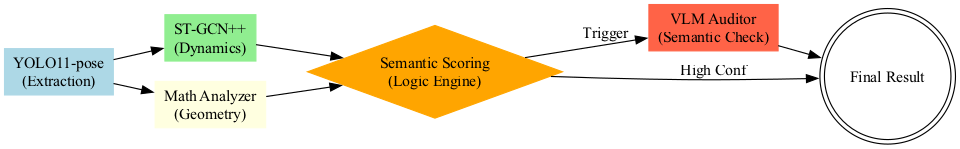

# Распознавание действий по скелетным данным 

Проект реализуется для онлайн-кинотеатра КИОН. Цель — разработка прототипа системы распознавания действий человека (индивидуальных и групповых) по скелетным данным (ключевым точкам).

## Архитектура проекта


Мы используем каскадный подход, сочетающий скорость классических нейросетей и глубину визуально-языковых моделей.

## Логика принятия решений
Система не принимает решение по одному кадру. Реализована **многоуровневая агрегация**, которая превращает поток предсказаний в осмысленный вердикт.

### 1. Взвешенная агрегация 
Базовые NTU-действия (60 классов) группируются в целевые категории через систему весов. Например:
*   `HUG_SCORE = (hugging * 1.5 + pat_on_back * 1.2)`
*   `JUMP_SCORE = (jump_up * 10.0 + hopping * 10.0 + cheer_up * 1.5)`

### 2. Поправка на динамику 
Система вычисляет среднюю скорость движения ключевых точек.
*   **Высокая динамика** → Усиливает веса для `Fight`, `Jump`, `Dance`.
*   **Низкая динамика** → Усиливает веса для `Sit`, `Smoking`, `Hug`.

### 3. Специальные стратегии 
Для минимизации ошибок классификации введены правила верхнего уровня:
*   **Handshake Rescue:** Усиливает рукопожатие, если зафиксировано сближение двух людей и социальный контакт при низкой агрессии.
*   **Dance Boost:** Если дружелюбных взаимодействий больше, чем агрессивных, а активность высокая — система склоняется к танцу.
*   **Jump Correction:** Прыжок подтверждается только при наличии реальной фазы отрыва от земли, иначе действие трактуется как танец (оживленность).

### 4. VLM Override
Для самых сложных классов (Курение, Митинг, Tug of War) вызывается **VLM**, который проводит семантический анализ кадра и может переопределить решение GCN.

### Метрики по классам (F1-Score)
| Класс | Precision | Recall | F1-Score |
| :--- | :---: | :---: | :---: |
| **Rally (Meeting)** | 0.92 | 1.00 | **0.96** |
| **Tug of War** | 1.00 | 0.91 | **0.95** |
| **Sitting** | 0.80 | 1.00 | **0.89** |
| **Jumping** | 0.88 | 0.88 | **0.88** |
| **Dancing** | 0.69 | 1.00 | **0.82** |
| **Smoking** | 1.00 | 0.63 | **0.77** |
| **Fighting** | 0.75 | 0.67 | **0.71** |
| **Circle/Triangle** | 1.00 | 0.55 | **0.71** |
| **Handshake** | 1.00 | 0.50 | **0.67** |
| **Walking** | 0.50 | 0.57 | **0.53** |

**Производительность:** Средний FPS системы составляет **97.55**, что позволяет обрабатывать 1 час FullHD видео всего за **15 минут**.


## Структура репозитория
```text
tsu-cv-msc-skeleton-actions/
├── configs/               # Конфигурации ST-GCN++ и VLM
├── data/                  # Видео для тестирования и валидации
├── deploy/docker/         # Инфраструктура развертывания (Docker)
├── models/                # Веса моделей (YOLO11, ST-GCN++, Qwen2-VL)
├── research/              # Архив экспериментов и промежуточных тестов
├── scripts/               # Скрипты запуска и бенчмаркинга
│   ├── benchmark_kion.py  # Запуск полной оценки системы
│   ├── infer_vlm.py       # Демонстрационный инференс на видео
│   └── download_all.sh    # Загрузка всех необходимых весов
├── src/                   # Ядро системы 
│   ├── classifiers/       # Реализация ST-GCN++
│   ├── utils/             # Адаптеры скелетов, буферы, маппинги
│   ├── vlm/               # Клиент-серверная часть для VLM
│   ├── detector.py        # Обертка над YOLO11-pose
│   └── analyzer.py        # Математический анализ групп
├── training/              # Скрипты обучения классификаторов
├── results/               # CSV и JSON метрики 
├── docker-compose.yml     # Запуск/Compose
└── requirements.txt       # Зависимости проекта
```

## Запуск

### 1. Подготовка окружения
```bash
# Создание venv
python -m venv venv
source venv/bin/activate

# Установка зависимостей
pip install -r requirements.txt
```

### 2. Загрузка весов моделей
```bash
bash scripts/download_stgcn++.sh
# YOLO веса скачаются автоматически при первом запуске
```

### 3. Запуск аналитики 
Для запуска без VLM (на CPU/Mac):
```bash
python scripts/benchmark_kion.py --data-dir data --no-vlm --save-video
```

### 4. Развертывание в Docker (для запуска полного каскада с VLM)
```bash
docker-compose up --build
```
### 5. Запуск
```bash
python scripts/benchmark_kion.py --data-dir data 
```

### Особенности и оптимизации
*   **Performance Skip (Каждый 5-й кадр):** Для достижения скорости обработки (97.5 FPS) система анализирует скелеты и группы только на каждом 5-м кадре. ST-GCN++ сохраняет временную связность внутри окна в 32 кадра, что позволяет не терять точность при пятикратном ускорении.
*   **VLM Logic:** VLM делает выборку из 3-х ключевых кадров события. Решение VLM принимается только при консенсусе (минимум 2 кадра из 3-х показывают одно действие). Если голоса разделились (1-1-1), система доверяет весам графовой нейросети.
*   **Geometric Analyzer:** Групповой анализатор использует физико-геометрические примитивы: 
    *   Расчет дисперсии расстояний до центроида (для детекции Круга/Треугольника).
    *   Анализ векторов наклона торса («leaning») для детекции перетягивания каната.
*   **Custom Evaluation Dataset:** Для финального тестирования мы собрали собственный датасет из 70+ фрагментов (7-8 на класс), вырезанных из художественных фильмов, что имитирует реальный контент платформы KION.
*   **Презентация:** Полный разбор преимуществ, ограничений и векторов развития представлен в презентации проекта.


